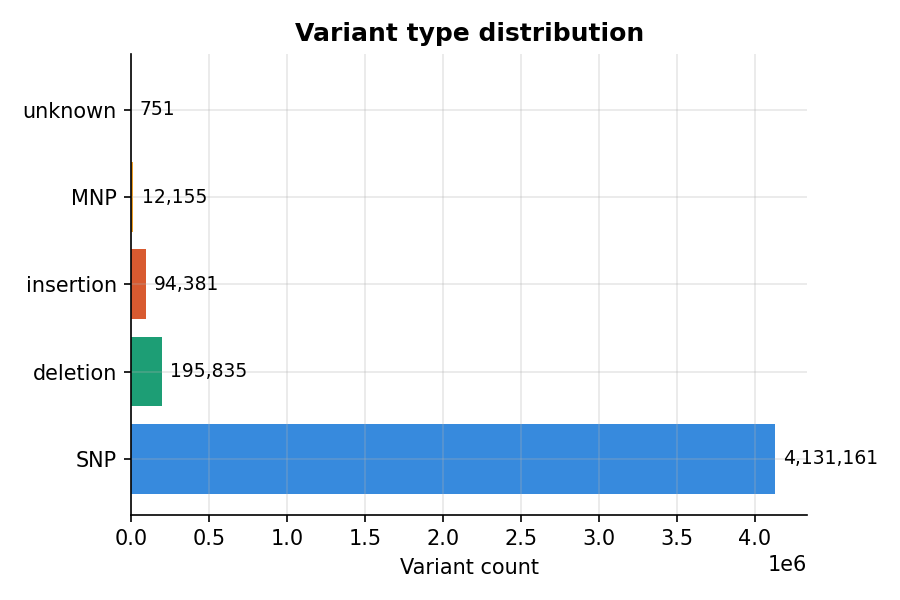
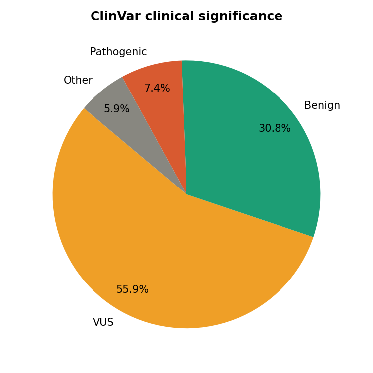
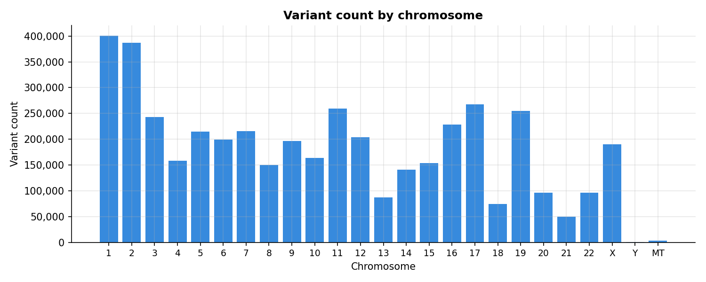

# VCF-Variant-Analysis-Pipeline
a Python project that parses VCF (genomic variant call format) files, runs statistical QC/filtering, and produces a summary report
## Results

### Variant type distribution

### ClinVar clinical significance

### Variants by chromosome

